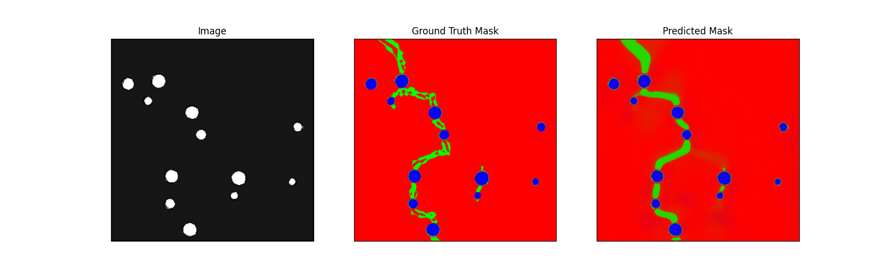

# Crack Detection in Electromechanical Materials using U-Net

[](https://www.python.org/downloads/)
[](https://www.tensorflow.org/)
[](LICENSE)

A deep learning approach for detecting and segmenting crack propagation in materials under electromechanical stress using U-Net architecture with ResNet backbones. This project applies computer vision techniques to analyze phase-field and electrical potential patterns from FEM simulations.

## 🎯 Overview

This repository implements semantic segmentation models to detect crack patterns in materials subjected to coupled mechanical and electrical stresses. The computer vision pipeline processes grayscale images from FEM simulations to identify and classify different regions:

- **Phase Field (PHI)**: Background, cracks, and holes
- **Electrical Potential (V)**: Left side, right side, and holes

### Example Prediction
Below is an example illustrating the model's input, the ground truth segmentation, and the model's predicted segmentation mask:



## 🔬 Computer Vision Approach

### Architecture
- **U-Net** with skip connections for precise localization
- **ResNet backbones** (34, 50, 101, 152) for feature extraction
- **Transfer learning** from ImageNet pre-trained weights

### Key Features
- Multi-class semantic segmentation (3 classes)
- Pixel-level crack detection with IoU > 0.95
- Comparison between phase-field and electrical potential visualization methods
- Automated hyperparameter tuning using Keras Tuner

## 📊 Dataset

- **10,000 FEM simulations** generated using ABAQUS
- **Image dimensions**: 512×512 pixels
- **Data split**: 70% training, 20% validation, 10% test
- **Classes**: 
  - Class 0: Background
  - Class 1: Minor defects/features
  - Class 2: Major cracks/boundaries

# 🔬 Computer Vision Problem Statement

### The Challenge
Traditional crack detection methods rely on edge detection algorithms (Canny, Sobel) or threshold-based approaches, which fail to:
- Distinguish between different severity levels of defects
- Handle varying lighting conditions and surface textures  
- Provide pixel-accurate segmentation masks
- Generalize across different materials and imaging conditions

### Our Solution
We employ **semantic segmentation** - a computer vision technique that classifies each pixel in an image into predefined categories. Unlike object detection (bounding boxes) or image classification (whole image labels), semantic segmentation provides:

- **Pixel-level precision**: Every pixel gets a class label
- **Multi-class support**: Distinguish between defect severities
- **Spatial understanding**: Preserve exact shape and location of defects
- **End-to-end learning**: No manual feature engineering required

## 🏗️ Architecture Deep Dive

### U-Net: The Backbone of Our Segmentation

U-Net is a fully convolutional network (FCN) specifically designed for biomedical image segmentation but has proven highly effective for industrial defect detection.

```
                    Input (512×512×3)
                           │
    ┌──────────────────────┴──────────────────────┐
    │                  ENCODER                     │
    │  ┌─────────────────────────────────────┐   │
    │  │ Conv Block 1: 512×512×64           │   │ ──┐ Skip Connection
    │  │ MaxPool 2×2 ↓                      │   │   │
    │  │ Conv Block 2: 256×256×128         │   │ ──┤
    │  │ MaxPool 2×2 ↓                      │   │   │
    │  │ Conv Block 3: 128×128×256         │   │ ──┤
    │  │ MaxPool 2×2 ↓                      │   │   │
    │  │ Conv Block 4: 64×64×512           │   │ ──┤
    │  │ MaxPool 2×2 ↓                      │   │   │
    │  └─────────────────────────────────────┘   │   │
    │                                             │   │
    │              Bottleneck                    │   │
    │               32×32×1024                   │   │
    │                                             │   │
    │                  DECODER                     │   │
    │  ┌─────────────────────────────────────┐   │   │
    │  │ UpConv 2×2 + Skip ← 64×64×512     │←──┼───┘
    │  │ Conv Block                          │   │
    │  │ UpConv 2×2 + Skip ← 128×128×256   │←──┤
    │  │ Conv Block                          │   │
    │  │ UpConv 2×2 + Skip ← 256×256×128   │←──┤
    │  │ Conv Block                          │   │
    │  │ UpConv 2×2 + Skip ← 512×512×64    │←──┘
    │  │ Conv Block                          │   │
    │  └─────────────────────────────────────┘   │
    └──────────────────────┴──────────────────────┘
                           │
                    Output Conv 1×1
                           │
                 Segmentation Map (512×512×3)
```


## 🚀 How to Run the Codes

Follow these steps to set up your environment and execute the scripts:

---
### 1. Prerequisites
* **Python**: Ensure you have Python 3.8 or newer installed.
* **Git**: Required for cloning the repository.
* **(Optional) ABAQUS**: Needed only if you intend to regenerate the primary dataset from FEM simulations as described in the thesis.

---
### 2. Installation
1.  **Clone the Repository**:
    Open your terminal or command prompt and run:
    ```bash
    git clone [https://github.com/BBahtiri/Computer-Vision-Crack-Detection.git](https://github.com/BBahtiri/Computer-Vision-Crack-Detection.git)
    cd Computer-Vision-Crack-Detection
    ```

2.  **Create and Activate a Virtual Environment** (Recommended):
    ```bash
    python -m venv venv
    ```
    Activate the environment:
    * On Windows:
        ```bash
        venv\Scripts\activate
        ```
    * On macOS/Linux:
        ```bash
        source venv/bin/activate
        ```

3.  **Install Dependencies**:
    Install all required Python libraries using the `requirements.txt` file:
    ```bash
    pip install -r requirements.txt
    ```

---
### 3. Data Preparation
1.  **Dataset Source**: The primary dataset for this project was generated from 10,000 Finite Element Method (FEM) simulations using ABAQUS, as detailed in the accompanying Master Thesis. If you are not regenerating this dataset, you will need to have your set of images (e.g., `*_frame_0.png`) and their corresponding label masks (e.g., `*_frame_last.png`).

2.  **Organize Your Data**:
    Before splitting, place your raw images and labels into separate directories. For example:
    ```
    data_root/
    ├── all_images/
    │   ├── sim0001_frame_0.png
    │   └── ...
    └── all_labels/
        ├── sim0001_frame_last.png
        └── ...
    ```

3.  **Split into Train/Validation/Test Sets**:
    Use the `src/split_data.py` script to organize your dataset into the required structure for training and evaluation.
    ```bash
    python src/split_data.py path/to/your/all_images path/to/your/all_labels --output-dir ./name_of_processed_data_directory
    ```
    Replace `path/to/your/all_images` and `path/to/your/all_labels` with the actual paths to your data. This command will create subdirectories like `train_images/`, `train_labels/`, `val_images/`, `val_labels/`, `test_images/`, and `test_labels/` inside the specified `--output-dir` (e.g., `./data_dir_PHI` or `./data_dir_V`).

4.  **Configure Script Paths**:
    Before running any training or inference script, you **must** update the `DATA_DIR` variable (and potentially other path-related variables) within the `Config` class at the beginning of that specific Python script (e.g., in `src/hyper.py`, `src/phi.py`, `src/prediction_new_model.py`). This path should point to your processed data directory created in the previous step.

    For example, in `src/phi.py`, you might change:
    ```python
    class Config:
        DATA_DIR = "./name_of_processed_data_directory" # Or, e.g., "data_dir_PHI"
        # ... other configurations
    ```

---
### 4. Running the Python Scripts

Ensure your virtual environment is activated and you are in the root directory of the project (`Computer-Vision-Crack-Detection`) in your terminal.

1.  **Hyperparameter Tuning** (Recommended to find optimal model parameters):
    * Verify/update the `Config` class in `src/hyper.py` (especially `DATA_DIR`).
    * Run the script:
        ```bash
        python src/hyper.py
        ```
    * This will initiate the Keras Tuner search. The best model found will be saved (e.g., `best_unet_hyper_tuned_corrected.h5`), and logs will be stored in a directory like `hyperband_tuning_output_corrected/`.

2.  **Training a Specific Model Configuration**:
    * To train a model using, for example, the custom U-Net defined in `src/phi.py`:
        * Verify/update the `Config` class in `src/phi.py`.
        * Run the script:
            ```bash
            python src/phi.py
            ```
    * Similarly, you can run `src/seg_model_train.py` after configuring its `Config` class.
    * These scripts will save the trained model (e.g., `best_model_phi_corrected.h5`) and create training logs.

3.  **Inference (Running Predictions on New Data)**:
    * Modify the `Config` class in `src/prediction_new_model.py`:
        * Set `MODEL_PATH` to the path of your trained `.h5` model file.
        * Ensure `BACKBONE` matches the architecture of the loaded model.
        * Set `TEST_IMAGES_DIR` and `TEST_LABELS_DIR` to your test dataset paths.
    * Execute the script:
        ```bash
        python src/prediction_new_model.py
        ```
    * This will load the specified model, perform predictions on images from your test set, and visualize the results. Predictions might be saved in an `predictions_output/` directory if configured.

---

## 📊 Evaluation Metrics

- **IoU (Intersection over Union)**: Primary metric for segmentation accuracy
- **F1-Score**: Harmonic mean of precision and recall
- **Confusion Matrix**: Per-class classification accuracy


## 📄 License

This project is licensed under the MIT License - see the [LICENSE](LICENSE) file for details.

## 🙏 Acknowledgments

This work is done in collaboration with Jaykumar Mavani
